# Minecraft: Education Edition in Code Builder: primeri z uporabo orodja MakeCode

*Za osnovna navodila začni z branjem v datoteki [README](README.md).*

## Primeri programčkov

### Prikliči pomočnika (agenta)

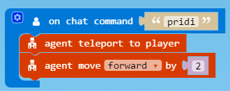

Programček prikliče agenta, agent naredi 2 koraka naprej (da ni čisto ob igralcu). Uporabljeni so gradniki iz predala `PLAYER` in `AGENT`. Programček se izvede, ko v ukazno vrstico vpišemo izbran ukaz `pridi` (seveda ga lahko preimenujemo tudi drugače). 

### Posadi rožice

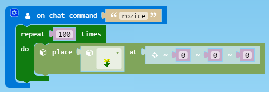

Pokažemo gradnik `place` iz predala `BLOCKS`, s katerim lahko izberemo, kateri blok se postavi na izbrani poziciji. Da je primer bolj zabaven, uporabimo še gradnik `repeat` iz predala `LOOPS` in pokažemo, kako se za igralcem posadi 100 rožic ob hoji.

### Dežujejo živali!

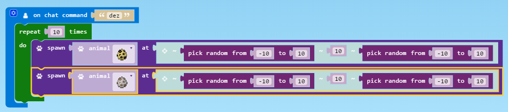

Še en preprost primer, tokrat z uporabo gradnika `spawn` iz predala `MOBS`. S tem gradnikom se ob igralcu naredi izbrana žival. Da bo žival padla iz neba, drugo vrednost `at` nastavimo na 10 (ali še več) blokov nad igralcem, za določenje pozicije levo/desno ter nazaj/naprej pa uporabimo gradnik `pick random` iz predala `MATH`, tako da bo žival vsakič padla iz malce drugačnega položaja. 

Primer naredimo bolj zabaven tako, da dodamo še en gradnik `spawn` z drugo izbrano živaljo in oboje z gradnikom `repeat` ponovimo poljubno-krat. S tem ustvarimo zabaven dež živali.

### Izpis imena z bloki

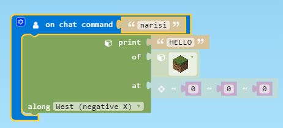

S pomočjo gradnika `print` iz predala `BLOCKS > VOLUMES` lahko z izbranim materialom izpišemo poljubno besedo. Za začetek izbrano besedo "zapečemo" v program. Vidimo, da je postopek zoprn, ko hočemo izpisati novo besedo, zato si bomo življenje olajšali s spremenljivkami. V tem primeru bomo uporabili spremenljivko `ime`, s pomočjo katere bomo lahko v ukazni vrstici vsakič določili novo ime za izpis (npr. `narisi Alja`, `narisi Matevz`).

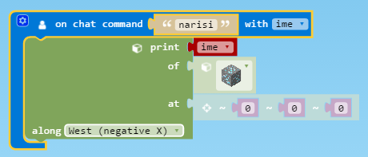

Do nadgrajene različice programa pridemo tako, da iz predala `PLAYER` izberemo gradnik `on chat command "jump" with number`. Na gradniku kliknemo na kolešček za nastavitve levo zgoraj in v oddelek `Command arguments` povlečemo element `string` in odstranimo obstoječi `number` (glej spodnjo sliko). S tem poskrbimo, da bo naš programček sprejemal pravilno vrsto ukazov; če imamo pod `Command arguments` nastavljeno `number` bo program po ukazu sprejel številko, če imamo izbran `string` pa bo sprejemal niz znakov (brez presledka). Seveda ima lahko programček tudi več argumentov, npr. višina in širina, za kar pod `Command arguments` nastavimo dve števili.

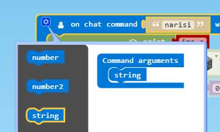

Ko programčku določimo ustrezen tip argumenta, s klikom na kolešček nastavitve programčka ponovno skrijemo. Za lažje sledenje različnim spremenljivkam, jim lahko dodelimo bolj jasna imena. V programčku s klikom na `string` dobimo meni, v katerem lahko spremenimo ime spremenljivke (`Rename variable`). 

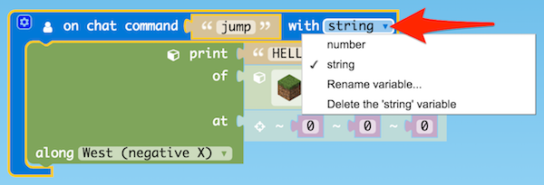

V predalu `VARIABLES` nato poiščemo spremenljivko, v kateri shranjujemo ime za izpis, ter nadomestimo element z narekovaji na začetku gradnika `print`, tako da dobimo tak programček:

### Pomočnik nariše kvadrat

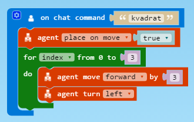

Začnimo z malo bolj kompleksnim ustvarjanjem. Gradnik `agent place on move true` iz predala `AGENT` uporabimo za to, da pomočnik ob premikanju za sabo pušča bloke. **Pred uporabo tega ukaza moramo poskrbeti za to, da ima agent v svojem inventarju nek material** (desni klik na agenta, da se odpre njegov inventar, v katerega lahko prenesemo material iz svojega inventarja). 

Nato iz bloka `LOOPS` potegnemo gradnik `for index from 0 to 4`, ki ga uporabimo za to, da narišemo 4 stranice kvadrata. Pri vsaki stranici se pomočnik pomakne za 3 mesta naprej ter se nato obrne na levo. Vidimo, da se pomočnik zatakne pri zadnjem bloku. Zato lahko sestavimo še malo bolj kompleksen primer, kjer uporabimo gradnik `if then else` iz predala `LOGIC`, s katerim preverimo, ali ima pomočnik pred sabo oviro; ko naleti na oviro, naj se prestavi za en blok gor.

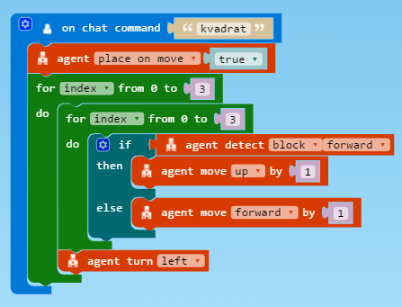

Za lažje razumevanje lahko gradnike `for` nadomestimo z `repeat`. Omenimo lahko, da se tudi pri pravem programiranju iste stvari da narediti na različne načine.

### Dodatno: Kvadrat v več nadstropjih

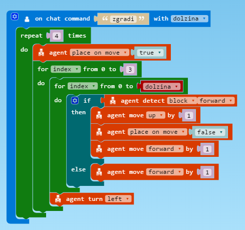

Pokažemo lahko še malo bolj kompleksen primer gradnje kvadratov v več nadstropjih, kjer izklopimo `place on move` in uporabimo spremeljivko `dolzina`, da ob poganjanju ukaza dinamično povemo, kako velik kvadrat hočemo.

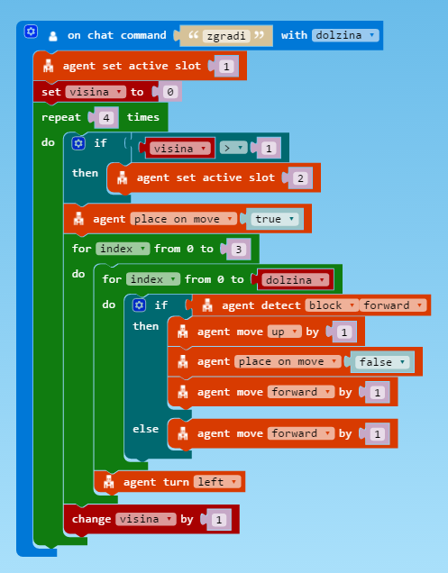

Še ena nadgradnja primera, pri katerem uporabimo spremenljivko `visina`, da z gradnikom `agent set active slot 2`  zamenjamo material gradnje. Ta različica seveda deluje v primeru, da ima pomočnik material v primernem predalu (`slot 2`).

### Spoznajmo gradbenika

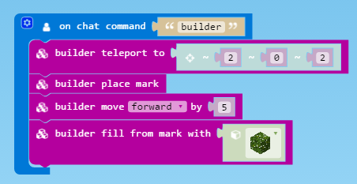

Pri izgradnji bolj kompleksnih struktur si lahko pomagamo z gradbenikom (predal `BUILDER`). Deluje podobno kot pomočnik, vendar olajša izbirmo materialov. Na sliki je preprost primer, učence spodbudimo, da z pomočjo gradbenika naredijo to, kar so prej naredili s pomočjo pomočnika. 

Namig: bloke "brišemo" s postavljanje bloka zraka (`air`) na želeno mesto. Pomočnik pa ima na voljo možnost uničevanja blokov (`destroy`). 

## Razlike med različnimi načini grajenja

Orodje MakeCode ponuja več različnih načinov za gradnjo. Za preproste oblike lahko uporabimo predal `BLOCKS`, za vodeno gradnjo uporabimo pomočnika `AGENT`, za bolj kompleksne projekte pa `BUILDER`. Seveda lahko tudi kombiniramo iste načine v enem programu. 

Vsak način ima svoje prednosti in omejitve. Pomočnik ima recimo z lastnim inventorijem večjo izbiro objektov, ki jih lahko postavlja, ga pa je težje postaviti na točno določeno točko, saj se orientira glede na igralca. Gradbenik nam olajša bolj kompleksno grajenje, ima pa omejen nabor blokov, ki jih lahko izberemo. Učence lahko spodbudimo k temu, da sami najdejo razlike med različnimi orodji. Hitro lahko ugotovimo tudi, da je več načinov, da pridemo do želenega rezultata.

Ko začnejo učenci sestavljati daljše programe, jih lahko spodbudimo k temu, da poiščejo ponavljajoče vzorce in skrajšajo programček z uporabo zank (`LOOPS`), logičnih pogojev (`LOGIC`), spremenljivk (`VARIABLES`) in matematičnih izrazov (`MATH`).

Programi lahko kličejo tudi druge programe z uporabo `run chat command ""` iz predala `PLAYER`, tako da lahko bolj kompleksne programe razbijemo v manjše programe (funkcije). 

## Urejanje MakeCode projektov

Na koncu dneva lahko svoje programčke shranimo na računalnikom s klikom na ikono z disketo in jih tako uporabimo na drugem računalniku z Microsoft: Education Edition in Code Builderjem.

S klikom na `Projects` (zgoraj desno) pridemo do okna s seznamov vseh lokalnih projektov, za dodaten navdih pa kliknemo na zavihek `Examples`, kjer so na voljo primeri projektov, ki jih lahko poskusimo v svojem svetu. Za prenos programčkov med projekti označimo programček (ali del programa), ga skopiramo s pritiskom na tipki `Ctrl + C` in prilepimo v drug projekt s kombinacijo `Ctrl + V`. 

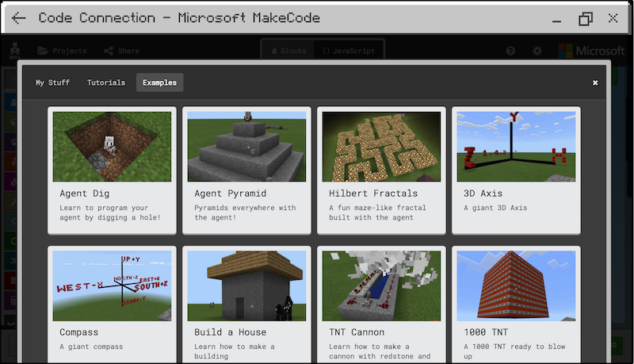

Za lažjo organizacijo med projekti, lahko svoje projekte preimenujemo s klikom na ikono za nastavitve zgoraj desno zraven logotipa Microsoft in izberemo možnost `Project Settings`. 

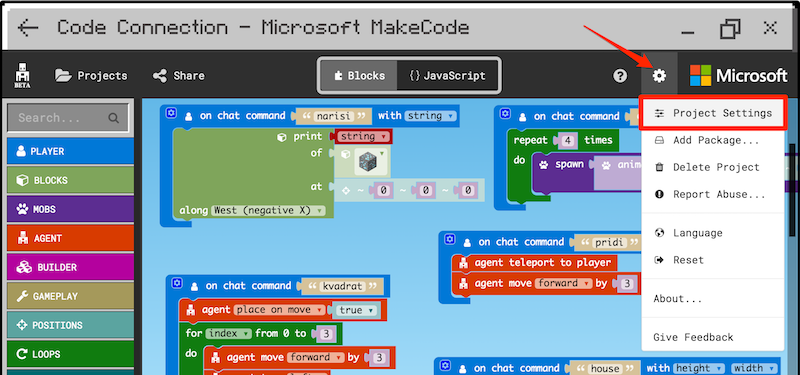