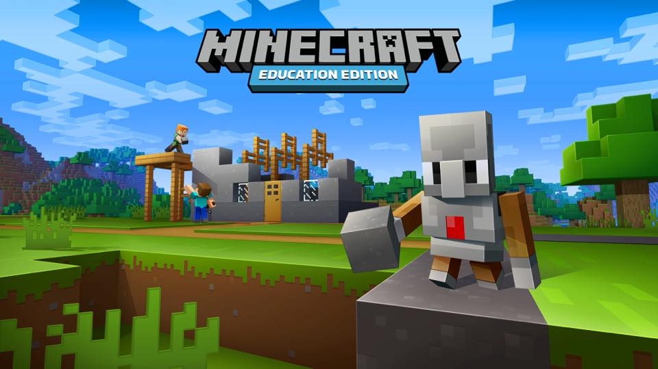
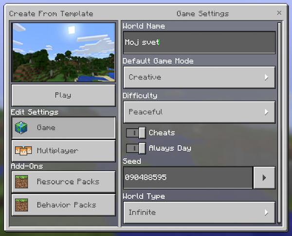
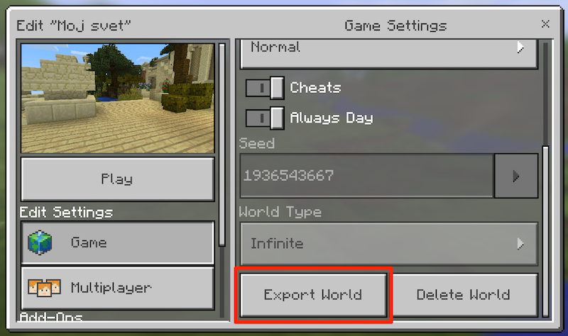
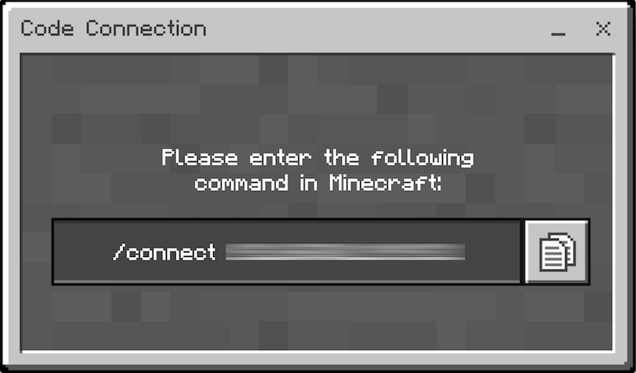
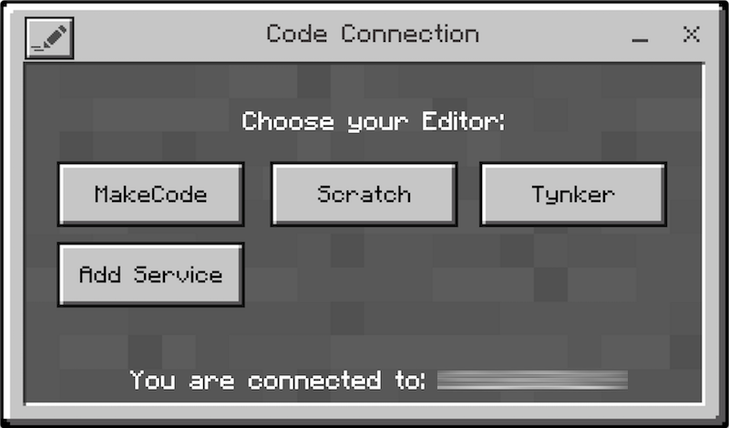
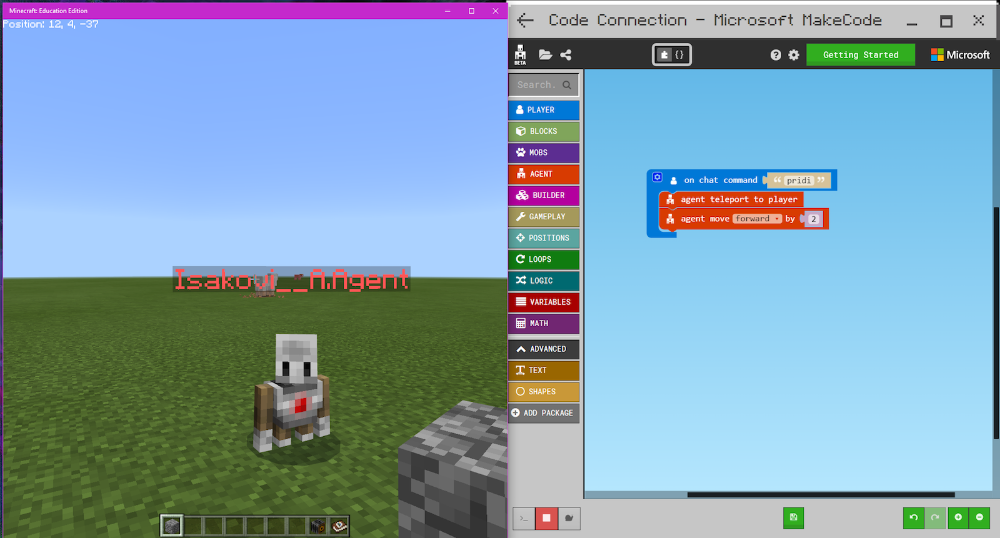
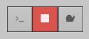
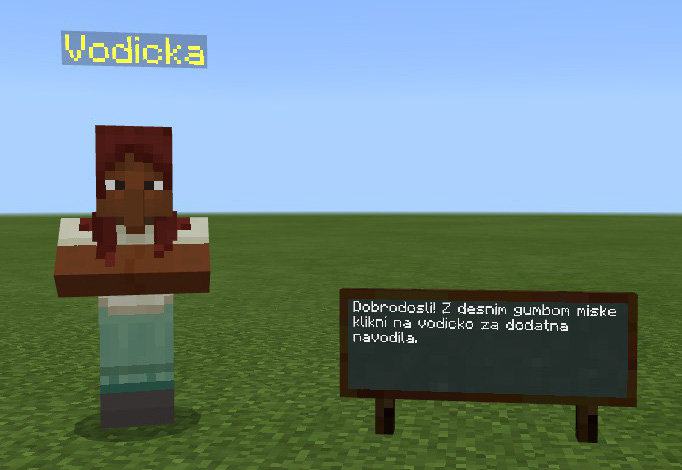
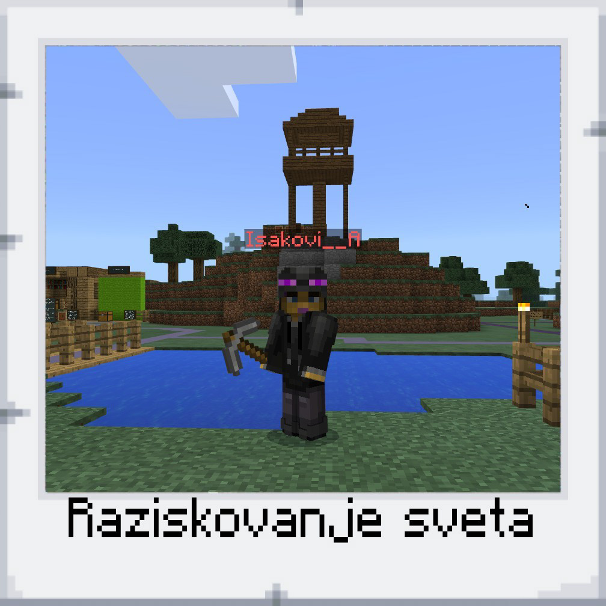

# Minecraft: Education Edition in Code Builder — vodič za učitelje

[**Minecraft: Education Edition**](https://education.minecraft.net/) je posebna različica igre Minecraft, ki ima vgrajena orodja za poučevanje programiranja ter enostavno uporabo Minecrafta med poukom. V tem vodiču bomo predstavili uporabo Minecraft: Education Edition z dodatkom Code Builder, ki omogoča enostavno vizualno programiranje z bloki. 

Oba programa sta [na voljo](https://education.minecraft.net/get-started/download) za operacijska sistema Windows 10 ali Mac OS. **Za prijavo v Minecraft: Education Edition je potreben izobraževalni Microsoftov račun z aktivno licenco.** Licence so na voljo šolam in drugim izobraževalnim ustanovam, ki uporabljajo Microsoftove izobraževalne storitve. Več informacij o dostopnosti licenc lahko najdete na [uradni spletni strani](https://education.minecraft.net/support/faq/). 

## Minecraft osnove

### Ustvarjanje novega sveta

- preden lahko začnemo ustvarjati, moramo ustvariti svoj svet (v meniju `Play`, nato pa klik na gumb `Create New`)
- nov svet lahko ustvarimo na podlagi ene od predlog — `Blocks of Grass` je odlična predloga za svobodno ustvarjanje — ali ga naključno generiramo (`Generate Random`)

- pri ustvarjanju novega sveta se lahko odločimo za samostojen svet (`Game`) ali svet, namenjen večim igralcem (`Multiplayer`), v katerega bodo lahko preko zavihka `Friends` vstopili drugi igralci, ki so povezani v isto omrežje in uporabljajo isto verzijo Minecrafta
- pri samostojnem svetu lahko izbiramo način igre (nastavitev `Default Game Mode`)
  - za nemoteno ustvarjanje predlagamo način `Creative`, pri težavnosti (nastavitev `Difficulty`) pa možnost `Peaceful`, da nas ne bodo motile razne pošasti
- za uporabo Code Builderja je potrebno vključiti dodatne ukaze (`Cheats`), po želji lahko vključimo tudi možnost `Always Day`, s čemer si zagotovimo, da nas v svetu ne bo presenetila noč
- ko smo zadovoljni z imenom in nastavitvami, kliknemo na gumb `Play`, da vstopimo v novo ustvarjen svet

### Posebne predloge za Minecraft začetnike

- interaktiven vodič osnovnih ukazov, predstavitev interakcije s svetom ter posebnih orodij za učitelje je na voljo v predlogi `Tutorial Volume`, ki jo lahko izberemo pri ustvarjanju novega sveta
- predloga `The Agent Trials` je interaktiven vodič z izzivi za pomočnika (Agenta), ki ga upravljamo s pomočjo Code Builderja

### Prenos svetov med računalniki

- svetovi narejeni v Minecraft: Education Edition delujejo samo v tej različici

- svetovi se ne prenašajo med računalniki ob prijavi z istim računom, omogoča pa Education Edition enostaven izvoz in uvoz svetov preko datotek `.mcworld`

- za izvoz sveta kliknemo na ikono za urejanje na začetnem seznamu svetov in se premaknemo do konca zaslona s podrobnosti o svetu ter kliknemo na gumb `Export World`

  

- na svoj računalnik nato shranimo datoteko `.mcworld`, ki jo lahko odpremo na drugem računalniku, ki ima nameščen Minecraft: Education Edition

### Osnovni ukazi

#### Premikanje po svetu

- premikanje naprej, nazaj, levo in desno: tipke `W A S D`
- letenje (dela samo v načinu Creative): dvakrat preslednica (`Space`) za začetek ali konec letenja, nato preslednica za dviganje in `Shift` za spuščanje
- hitrejše premikanje na tleh ali v zraku: drži tipko `Control`
- plazenje po tleh: drži tipko `Shift`
- menjava pogleda: tipka `F5` za spremembo iz prvo-osebnega v tretje-osebnega od zadaj in od spredaj ter nazaj v prvo-osebnega

#### Upravljanje predmetov

- prikliči inventar (inventory): tipka `E`
- izbira elementa v orodni vrstice: tipke 1-9 ali premikanje koleščka na miški
- spusti trenutno označen predmet: tipka `Q`

#### Interakcija s svetom

- razbijanje blokov: levi klik miške
- gradnja blokov: desni klik miške
- uporaba posebnih predmetov: desni klik na predmet

#### Ukazna vrstica

- ukazna vrstica za klepet in Code Builder ukaze: za prikaz tipka `T` ali `Enter`, za izhod tipka `Escape`
- s puščicami gor in dol se premikamo po zgodovini ukazov
- s tipko `Tab` si lahko pomagamo pri pisanju ukazov (auto-complete)
- ukaz za prestavljanje na dan: `/time set day` ([dodatni ukazi za nastavljanje ure](http://minecraft.gamepedia.com/Day-night_cycle)) 
- ukaz za nastavitev jasnega vremena: `/weather clear` ([dodatni ukazi za vreme](http://minecraft.gamepedia.com/Weather))

#### Code Builder 

- ukaz `/code` požene Code Connection
- prestavljanje med programom  Minecraft in programom Code Connection: `Alt + Tab` za preskok med okni ali tipka `Escape` v Minecraftu, da se sprosti kurzor miške

## Podrobna navodila za Code Builder

### Namestitev

- za uporabo Code Builderja poleg programa Minecraft: Education Edition potrebujemo še program **Code Connection** ([povezava za prenos](https://education.minecraft.net/get-started/download))
- v Minecraftu je potrebno ustvariti nov svet (na podlagi predloge ali naključno generiran), v katerem je omogočena možnost `Cheats` (predlagamo `Creative` način)
- po vstopu v svet lahko Code Connection zaženemo tako, da prikličemo ukazno vrstico in vpišemo ukaz `/code`
- odpre se Code Connection, ki nam pove naslov, na katerega se moramo iz programa Minecraft povezati

- za povezavo zopet uporabimo ukazno vrstico v Minecraftu, v katero skopiramo celoten naslov, ki nam ga ponudi Code Connection: `/connect XXX.XXX.XXX.XXX:XXXX` (namesto X-ov bodo seveda številke, ta korak je potrebno opraviti le prvič, ko poženemo Code Connection)
- v primeru uspešne povezave, se v programu Code Connection pokažejo gumbi za izbiro urejevalnika ter spodaj izpiše vrstica: `You are connected to XXX.XXX.XXX:XXXX`

- v programu Code Connection izberemo orodje, s katerim želimo programirati: **MakeCode**
- v Minecraft svetu se pojavi pomočnik z imenom `<TvojeIme>.Agent` — ta pomočnik bo sprejemal in izvajal ukaze, ki jih bomo sprogramirali

### O pomočniku (Agent)

- pomočnik bo sledil ukazom, ki bodo ustvarjeni preko spletnega brskalnika v orodju MakeCode
- dobro je vedeti, da ima tvoj pomočnik lasten inventar stvari; če hočemo pomočniku prenesti material za gradnjo, lahko nanj kliknemo z desnim gumbom miške (podobno kot se odpira skrinja) in mu posodimo, kar potrebuje

### MakeCode

#### Osnovni program za priklic pomočnika

Za ogrevanje lahko sestavimo osnoven program, ki prikliče pomočnika in ga premakne za par korakov naprej.

Iz oddelka `Player` najprej na delovno površino potegnemo gradnik `On chat command ""` in med narekovaje vpišemo željen ukaz (npr. `pridi`). V oddelku `Agent` nato poiščemo gradnika `agent teleport to player` in `agent move forward by 1`  ter gradnike sestavimo, kot je prikazano na spodnji sliki.

Poskrbimo, da v orodju MakeCode teče simulator, odpremo ukazno vrstico in vpišemo ukaz, ki smo ga izbrali za program. Pomočnik bo izvedel podani ukaz po navodilih. S kombiniranje različnih gradnikov lahko sestavimo tudi bolj kompleksne programe.

Nekaj dodatnih primerov smo zbrali v [datoteki s primeri MakeCode programčkov](Minecraft_MakeCode_primeri.md).

V dokumentaciji je na voljo še več primerov in dodatnih razlag:

- preprost program za ustvarjanje živali: https://minecraft.makecode.com/getting-started
- predstavitev različnih blokov: https://minecraft.makecode.com/reference
- primeri različnih programov: https://minecraft.makecode.com/tutorials

#### Iskanje hroščev pri programiranju

V spodnjem levem kotu orodja MakeCode imamo posebne gumbe, ki nam pomagajo pri programiranju: prvi gumb pokaže celoten potek izvajanja ukazov, s sredinskim gumbom lahko zaustavimo in znova zaženemo simulator, s tretjim gumbom (polž) lahko izvajanje programa upočasnimo in tako lažje opazujemo potek izvajanja v svetu Minecraft. 

## Posebna orodja v Minecraft: Education Edition

- za učitelje so na voljo so **bloki za urejanje dostopa in pravic** (`allow`, `deny`, `block`), **NPC**-ji (agente, ki lahko učencem podajo informacije) ter informativne **table in posterji**, ki lahko prikazujejo besedilo in imajo dodano spletno povezavo

- za urejanje teh orodij je potrebno imeti vklopljen status World Builder, ki ga učitelj lahko izkopi za učence pri uporabi dodatnega programa **Classroom Mode**; pri delu s Code Builderjem je to manj relevantno, lahko pa Classroom Mode uporabimo pri postavljanju učnega okolja v Minecraftu

  - bližnjica za hiter vklopi/izklopi statusa World Builder: `/wb`

  

- za lažje zajemanje slik je na voljo **kamera**

  - bližnjica za dodelitev kamere igralcu: `/give @p camera` 
  - za slikanje sveta desni klik s kamero v roki
  - za selfije postavi kamero v svet in desno klikni ter počakaj na fleš, da se naredi slika

- za ogled posnetkov slik je potreben **porfolio**

  - bližnjica za dodelitev kamere igralcu: `/give @p porfolio` 
  - desni klik s portfolijem v roki, da se prikaže album slik, ki ima možnost izvoza .zip datoteke z vsemi posnetimi slikami

- [več informacij o kameri in porfoliju](https://education.minecraft.net/support/knowledge-base/using-cameras-portfolios/)

- primer selfija narejenega s kamero:

  